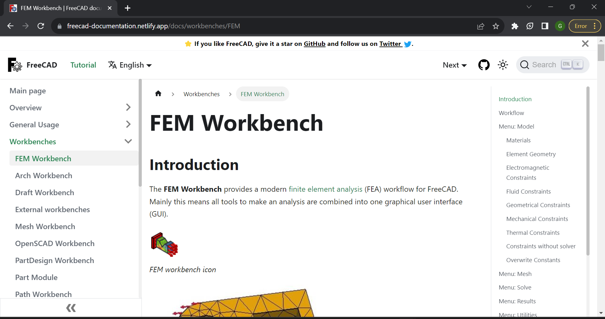
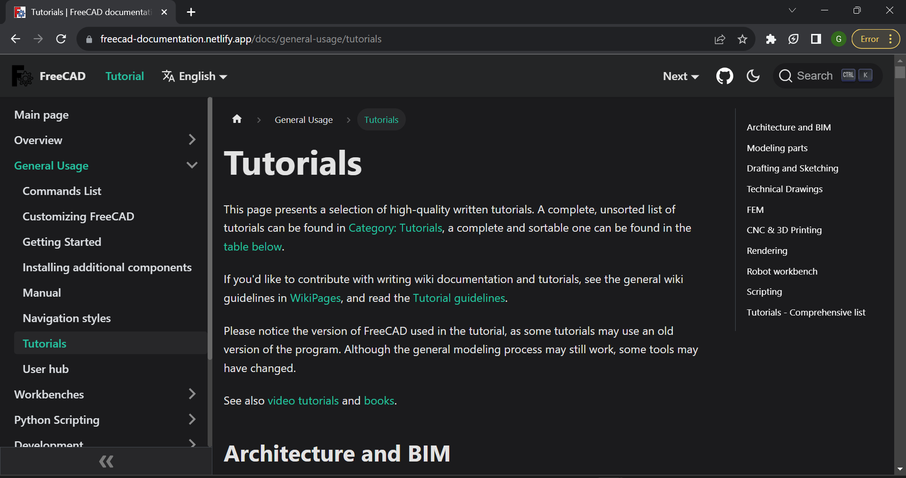
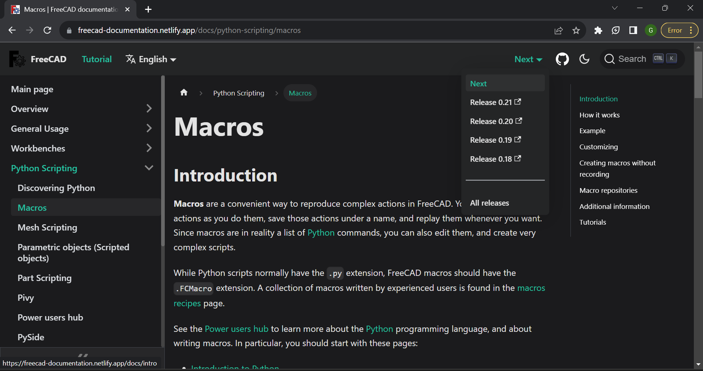
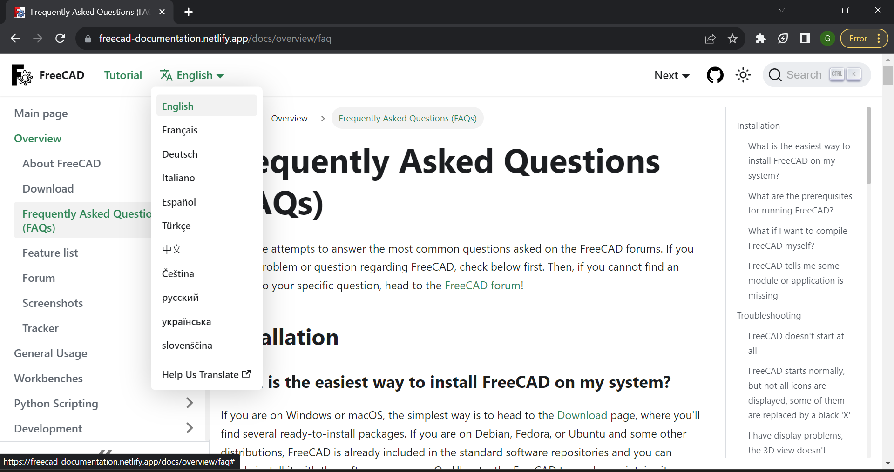
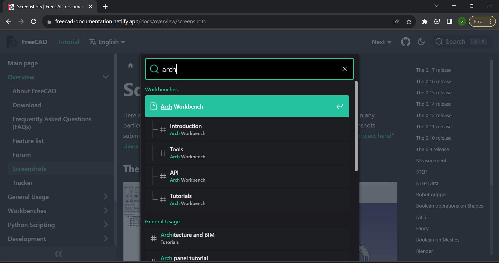
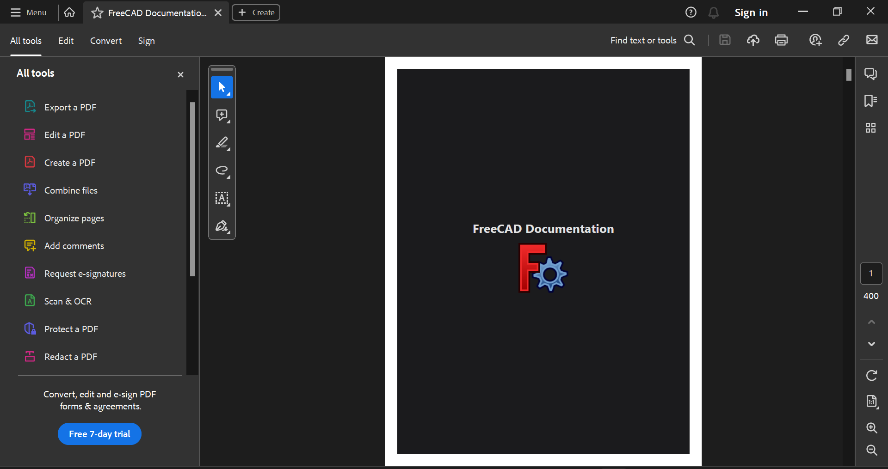
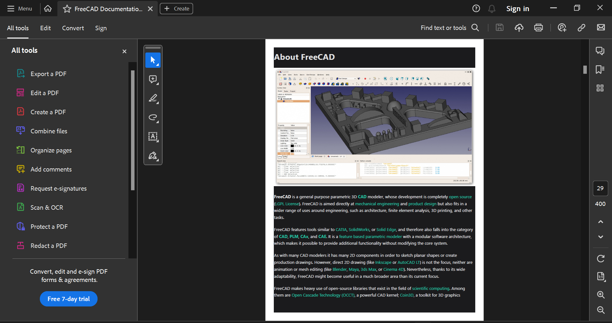

<div align="center">


<br />


<br />

<h1> Google Summer of Code 2023 </h1>
<h2> FreeCAD </h2>

</div>

## Table of Contents

- [About FreeCAD](#about-freecad)
- [Introduction](#introduction)
- [Project Team](#project-team)
- [Work Summary](#work-summary)
- [Future Work](#future-work)
- [Acknowledgments](#acknowledgments)
- [References](#references)
- [Help, Feedback, and Contribute](#help-feedback-and-contribute)

## About FreeCAD

- FreeCAD is a general-purpose parametric **3D computer-aided design (CAD) modeler** and a Building Information Modeling (BIM) software application with Finite-Element Method (FEM) support.  
- It is intended for mechanical engineering product design but also expands to a broader range of uses around engineering, such as architecture or electrical engineering.  
- FreeCAD is free and open-source, under the **LGPL-2.0-or-later** license, and available for Linux, macOS, and Windows operating systems.  

## Introduction

FreeCAD possesses a vast amount of documentation that is written by its users and hosted on the [FreeCAD Wiki](https://wiki.freecad.org/). The entire documentation is currently managed by MediaWiki software, which faces several problems and poses a potential threat.  

1. The MediaWiki software is massive and therefore, it becomes difficult and complicated to maintainup-to-date.
2. The data published on MediaWiki is hard to backup, so there is a constant risk of losing data.
3. The search feature supported by MediaWiki is extremely weak.

The FreeCAD documentation is as important as the software, and it  would benefit from the same level of decentralization.  

The **aim** was to rework the documentation system to a simple, file-based,versioned system that supports Git and Markdown for easy editing and version control, and offer FreeCAD users a good web-based experience with a robust search system.

## Project Team

- Contributor: Gauri Maheshwari - [GitHub](https://github.com/gauriimaheshwarii) | [LinkedIn](https://www.linkedin.com/in/gaurimaheshwari/) | [X](https://twitter.com/gaurii09)
- Mentors:
  - Kurt Kremitzki - [GitHub](https://github.com/kkremitzki) | [LinkedIn](https://www.linkedin.com/in/kurt-kremitzki-12524919/) | [X](https://twitter.com/thekurtwk)
  - Chris Hennes - [GitHub](https://github.com/chennes) | [LinkedIn](https://www.linkedin.com/in/chrishennes/) | [X](https://twitter.com/chrishennes)
- Organization Admin: Yorik van Havre - [GitHub](https://github.com/yorikvanhavre) | [LinkedIn](https://www.linkedin.com/in/yorik/) | [X](https://twitter.com/yorikvanhavre)

## Work Summary

### New documentation

A new documentation system is built using **[`Docusaurus`](https://docusaurus.io/)**, which builds a single-page application with fast client-side navigation.

  

*New documentation in light theme*

#### Description

- The documentation can now be viewed in both **light and dark themes**.

 

*New documentation in dark theme*

- Release notes of the FreeCAD software can be viewed directly from the navbar, without needing to navigate.



*Release notes dropdown menu*

- The option to switch to a different language is also provided in the navbar for convenience of the users.

  

*Language switch dropdown menu*

- The features of the documentation can be extended and customized by React components.

> For more information on the Docusaurus platform, check [here](https://docusaurus.io/docs).

### Search infrastructure

The documentation system now uses **`Algolia DocSearch`** to search within the documentation.  
[Commit c78eb6d](https://github.com/gauriimaheshwarii/FreeCAD-documentation-docusaurus/commit/c78eb6d586b4236b979da8fd40ab6925e89dff92)



#### Description

- DocSearch is a **free** search infrastructure.
- It is built on top of the latest version of [Algolia Autocomplete](https://www.algolia.com/doc/ui-libraries/autocomplete/introduction/what-is-autocomplete/), which provides better accessibility, increased responsiveness, themability, a better built-in design, and customizability under low-network conditions.
- Credentials and API key to use the search feature was provided via email after applying to the [DocSearch program](https://docsearch.algolia.com/docs/who-can-apply).

> More information on the DocSearch platform can be found [here](https://docsearch.algolia.com/).

### Offline documentation support

- Users can also make a **Developer's handbook** or and offline copy of the documentation, in a PDF format, by running the command:

```
npx docs-to-pdf --initialDocURLs="https://freecad-documentation.netlify.app/docs/intro" --contentSelector="article" --paginationSelector="a.pagination-nav__link.pagination-nav__link--next" --excludeSelectors=".margin-vert--xl a,[class^='tocCollapsible'],.breadcrumbs,.theme-edit-this-page" --coverImage="https://upload.wikimedia.org/wikipedia/commons/thumb/f/f7/FreeCAD-logo.svg/96px-FreeCAD-logo.svg.png?20230430105342" --coverTitle="FreeCAD Documentation" --outputPDFFilename="freeCAD-documentation.pdf"
```

 

*Cover page of the PDF format offline documentation*

- The PDF generated **supports hyperlinks**, and can be customized as per the user needs by the [CLI options](#cli-options-for-pdf-generation) mentioned below.

  

*Hyperlinks supported in offline documentation*

#### CLI options for PDF generation

| Option | Required | Description |
| - | - | - |
| --initialDocURLs | Yes | Set URL to start generating PDF from |
| --contentSelector | Yes | Used to find the part of main content |
| --paginationSelector | Yes | CSS Selector used to find the next page to be printed for looping |
| --excludeURLs | No | URLs to be excluded in PDF |
| --excludeSelectors | No | Exclude selectors from PDF. Separate each selector **with a comma and no space**. But you can use space in each selector. <br> **ex**: `--excludeSelectors=".nav,.next > a"` |
| --cssStyle | No | CSS style to adjust PDF output <br> **ex**: `--cssStyle="body{padding-top: 0;}"` |
| --outputPDFFilename | No | Name of the output PDF file <br> default is `freeCAD-documentation.pdf` |
| --pdfMargin | No | Set margin around PDF file. <br> separate each margin **with comma and no space**. <br> **ex**: `--pdfMargin="10,20,30,40"`. <br> This sets margin top: 10px, right: 20px, bottom: 30px, left: 40px |
| --coverTitle | No | Title for the PDF cover |
| --coverSub | No | Subtitle the for PDF cover. <br> Add `<br/>` tags for multiple lines. |
| --filterKeyword | No | Only adds pages to the PDF containing a given meta keywords. <br> Makes it possible to generate PDFs of selected pages. |

> For more information on CLI options, refer to [here](https://www.npmjs.com/package/docs-to-pdf).

## Future Work

Even though there is an option for language support, the markdown files still need to be translated.  
It is a work in progress, and the general idea of doing it is mentioned [here](https://docusaurus.io/docs/i18n/introduction).

- The potential platforms for doing the translations are [Crowdin](https://crowdin.com/) and [Transifex](https://transifex.com).  
[Weblate](https://weblate.org) was being considered earlier, but it has no markdown support, making it inviable.

- Translations were being done using the Crowdin platform, but it only had a free trial period of 14 days.

- The potential solution, which is now being worked upon, is to make an `i18n` folder with language subfolders in it and give a file-system structure like [this](https://docusaurus.io/docs/api/plugins/@docusaurus/plugin-content-docs#example-file-system-structure).

## Acknowledgments

I am thrilled that I had the opportunity to participate in the Google Summer of Code program this year.  

I am deeply grateful to my mentors [Kurt Kremitzki](https://github.com/kkremitzki), [Yorik van Havre](https://github.com/yorikvanhavre), and [Chris Hennes](https://github.com/chennes) for giving me the opportunity to work on a project which is so significant to the FreeCAD software.  
A special thanks to **Kurt Kremitzki**, who guided me patiently through the project and was always ready to help, review work in progress, and give feedback regarding the overall shape of the project and the feasibility of certain solutions. He devoted a lot of time to this project and led the video meetings in an organized, yet non-stressful manner.

I would also like to thank the **FreeCAD community** for their inputs, reviews, and suggestions on the project. Their support and positivity helped me throughout and made me enjoy every bit of it.

Last but not least, I sincerely appreciate Google and [Google Summer of Code](https://summerofcode.withgoogle.com/) organizers for this amazing initiative.

## References

- [New documentation](https://freecad-documentation.netlify.app/)
- [Project page](https://summerofcode.withgoogle.com/programs/2023/projects/iPaw5Jd9)
- [Issue link](https://github.com/FreeCAD/FreeCAD/issues/8558)
- [Forum discussion](https://forum.freecad.org/viewtopic.php?t=78143)
- [Project repository](https://github.com/FreeCAD/FreeCAD-documentation-docusaurus)
- [Forked repository](https://github.com/gauriimaheshwarii/FreeCAD-documentation-docusaurus)
- [Markdown guide](https://www.markdownguide.org/)

## Help, Feedback, and Contribute

- [FreeCAD Forum](https://forum.freecad.org/)
- [GitHub](https://github.com/FreeCAD/FreeCAD)
- [X](https://twitter.com/FreeCADNews)
- [LinkedIn](https://www.linkedin.com/groups/4295230)
- [IRC Channel](irc://chat.freenode.net/freecad)
- [Discord](https://discord.com/invite/w2cTKGzccC)
- [Facebook](http://www.facebook.com/FreeCAD)
- [Mastodon](https://fosstodon.org/@FreeCAD)
- [Gitter](https://gitter.im/FreeCAD/FreeCAD)
- [Reddit](https://www.reddit.com/r/freecad)
- [Bugs Tracker](https://github.com/FreeCAD/FreeCAD/issues)

Feel free to reach out to me to suggest changes, offer reviews, and discuss potential ideas for the project :)
